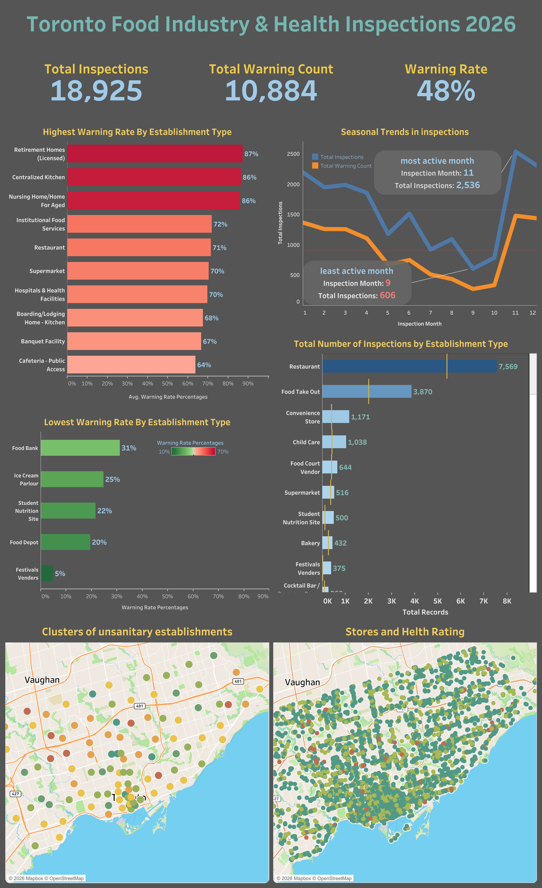

# Toronto Food Safety & Health Inspection Analysis (2026)

## 📊 Interactive Dashboard

Explore the full interactive dashboard on Tableau Public:

👉 [View Dashboard on Tableau](https://public.tableau.com/app/profile/yusei.hosoya/viz/TorontoFoodIndustryHealthInspections2026/Dashboard3)

---

## 📊 Overview
This project analyzes food safety inspection data from the City of Toronto to identify risk patterns across time, location, and establishment types. The goal is to uncover actionable insights that can support better public health monitoring and decision-making.

---

## 🗂️ Data Source
- City of Toronto Open Data
- DineSafe dataset
- City Ward dataset
---

## 🔍 Key Insights

### 1. High-Risk Establishment Types
Retirement homes and nursing homes show the highest warning rates, followed by hospitals.  
This is particularly concerning given that these facilities serve vulnerable populations and are expected to maintain stricter hygiene standards.

In contrast, festival vendors have the lowest warning rate at only 5%.  
Despite being temporary setups, they appear to operate under well-controlled conditions, resulting in consistently low risk.

---

### 2. Seasonal Trends in Inspections
Inspection activity shows a clear seasonal pattern.

- **May to October**: ~500–1200 inspections  
- **November to April**: ~2000–2500 inspections  

This suggests that the city may be prioritizing inspections during colder months, possibly due to increased indoor operations or policy-driven enforcement cycles.

Additionally, warning rates remain relatively high (around 60%) from January to April, indicating consistent compliance challenges during winter.

---

### 3. Inspection Volume by Establishment Type
Restaurants account for the highest number of inspections, which is expected due to their volume.  
However, this highlights the importance of comparing **rates rather than raw counts** when evaluating risk.

---

### 4. Spatial Risk Distribution
The map analysis reveals important spatial patterns:

- **Downtown Toronto**  
  High number of violations, but also many compliant establishments  
  → Moderate overall risk due to large denominator  

- **Outer regions (e.g., North-East, East)**  
  Fewer establishments but higher concentration of violations  
  → Higher relative risk  

This demonstrates that:
> Risk should be evaluated proportionally, not just by total counts.

---

### 5. Interactive Map Exploration
The dashboard includes interactive features:

- Click on an area (FSA level)
- Automatically zoom into store-level data
- View establishment names and penalty scores

This enables intuitive exploration of localized risk patterns.

---

## 🧠 Methodology

### Data Cleaning
- Standardized establishment names and types  
- Removed invalid values (e.g., 'none')  
- Extracted postal codes using REGEXP  

### Feature Engineering

#### Penalty Score
A weighted score was created based on violation severity:

- Crucial: 10 points  
- Significant: 5 points  
- Minor: 2 points  

This allows a more nuanced evaluation of risk beyond simple counts.

---

## 📌 Recommendations

Based on the analysis:

- Increase inspection frequency for high-risk facility types (e.g., nursing homes)  
- Investigate underlying causes of high warning rates in vulnerable-care facilities    
- Improve monitoring in outer regions with high relative risk  
- Optimize resource allocation based on geographic risk clusters  

---

## 🛠️ Tools Used
- SQL (BigQuery)
- Tableau (Data Visualization)

---

## 🚀 Conclusion
This analysis highlights key temporal, spatial, and categorical risk patterns in Toronto’s food safety system. By focusing on proportional risk and targeted enforcement, the city can improve inspection efficiency and public health outcomes.
